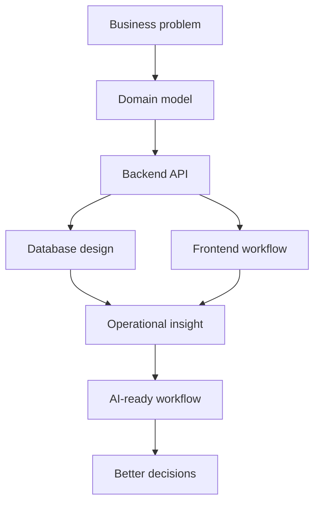

<div align="center">

# Hi, I'm Logan ☁️

### Friendly AI-native system builder

Growing systems carefully.  
Building backend, cloud, and AI-ready workflows with curiosity.


</div>

---

## About me 🌱

I'm learning to build systems that feel calm on the surface and serious underneath.

My work sits around backend architecture, cloud engineering, business workflows, and AI-native development. I like projects where the system has to model real operations, not just move data from one screen to another.

Right now, I'm focused on:

- AWS Cloud Engineering
- Backend architecture
- Distributed systems fundamentals
- AI-native workflows
- Scalable thinking
- Business-oriented systems

---

## Toolbox ⚙️

**Backend**  
FastAPI · SQLAlchemy · PostgreSQL · REST APIs · Authentication · Business logic

**Frontend**  
React · TypeScript · Tailwind CSS · Clean UI systems

**Cloud & DevOps**  
AWS · Docker · GitHub Actions · Deployment workflows

**AI-native workflow**  
Prompt systems · Context engineering · AI-assisted planning · Human-in-the-loop development

---

## Featured build ☁️

### [Leaf Creme](https://github.com/9ducanh9/LeafCreme)

A full-stack platform focused on backend architecture, business logic, scalable systems, and AI-ready workflows.

Leaf Creme is built around real operational ideas: inventory, orders, payments, products, user roles, and backend workflows that can grow into larger business systems.

**Tech stack:**  
FastAPI · PostgreSQL · SQLAlchemy · React · TypeScript · Tailwind · Docker · AWS

**What it represents:**

- Backend-first system thinking
- Real business workflow modeling
- Database-driven architecture
- API design for operational tools
- A foundation for future AI-assisted business features

---

## Current learning 🤖

```txt
cloud/          AWS fundamentals, deployment, architecture patterns
backend/        API design, auth, database modeling, service boundaries
systems/        scalability, reliability, distributed-system basics
ai-workflows/   context design, automation, AI-assisted engineering
product/        building software around real business needs
```

---

## System map



---

## Philosophy

> Context quality > context quantity.

I like systems that are understandable, maintainable, and useful before they become impressive.

Small decisions matter: naming, data flow, failure states, documentation, and the way a feature maps back to the real problem.

The goal is not to build louder software.  
The goal is to build systems that can keep growing.

---

## GitHub stats

<div align="center">


</div>

---

## Contact

I'm open to conversations around cloud, backend systems, AI-native workflows, and thoughtful product engineering.

<div align="center">

[Portfolio](https://portfolio.logantai.com) · [GitHub](https://github.com/9ducanh9)

</div>
