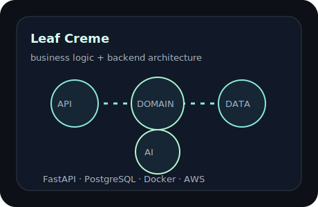
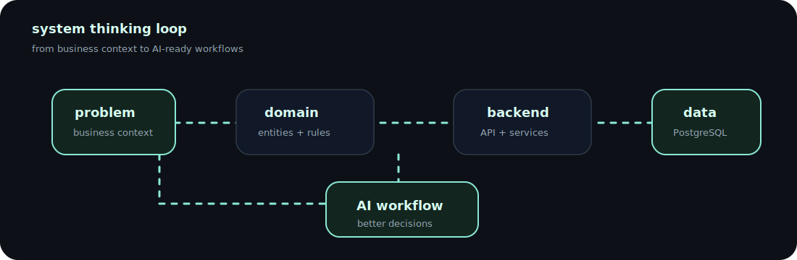

<div align="center">



# Lam Chi Tai (Logan)

### Friendly AI-native system builder, growing toward Cloud Solution Architecture


## 🌱 Still building and growing ☁️

<sub>Profile, projects, and systems are being refined one careful layer at a time.</sub>

<p>
  
  
  
</p>

</div>

---

## ☁️ About me

🎒 I'm an Information Systems student exploring the space between business workflows, backend systems, and cloud architecture.

☁️ Through the FCAJ AWS Bootcamp, I'm growing deeper into AWS Cloud Engineering and learning how real systems are designed, deployed, and scaled.

🧭 My Business Analysis foundation helps me think about requirements, processes, data flows, and business logic before jumping into code.

⚙️ I'm really into system design, especially structure, boundaries, and how systems scale over time.

🏗️ My long-term direction is Cloud Solution Architecture: designing systems that are practical, scalable, and aligned with real business needs.

---

## 🧭 Direction

Business Analysis gave me the habit of understanding workflows before building.

AWS is helping me turn that thinking into cloud architecture: systems that start from real requirements, then grow through backend services, databases, deployment, and scalability.

```txt
BA foundation → backend systems → cloud-native architecture → Solution Architect
```

---

## 🧰 Toolbox

<div align="center">


</div>

| Layer | Tools I reach for |
| --- | --- |
| Backend | FastAPI · SQLAlchemy · PostgreSQL · REST APIs · auth · business logic |
| Frontend | React · TypeScript · Tailwind · clean operational UI |
| Cloud | AWS · Docker · deployment workflows · GitHub Actions |
| System analysis | requirements · process modeling · data flows · technical documentation |
| AI workflow | prompt systems · context engineering · AI-assisted planning |

---

## 🌱 Featured build

<table>
  <tr>
    <td width="62%">
      <h3><a href="https://github.com/9ducanh9/LeafCreme">Leaf Creme</a></h3>
      <p>
        A full-stack platform focused on backend architecture, business logic,
        scalable systems, and AI-ready workflows.
      </p>
      <p>
        Leaf Creme models real operations: inventory, orders, payments, products,
        user roles, and backend workflows that can grow into larger business systems.
      </p>
      <p>
        It started from business workflow analysis, then grew into database design,
        API structure, role-based operations, and AI-assisted implementation.
      </p>
      <p>
        <strong>Stack:</strong> FastAPI · PostgreSQL · SQLAlchemy · React · TypeScript · Tailwind · Docker · AWS
      </p>
    </td>
    <td width="38%">
      
    </td>
  </tr>
</table>

**What it represents**

- Backend-first system thinking
- Real business workflow modeling
- 31-table relational database design
- 29 application workflows / pages
- Catalog, inventory, order, payment, and user-role flows
- FEFO-based inventory tracking
- RBAC authorization and MoMo QR payment integration
- Database-driven architecture
- API design for operational tools
- A foundation for future AI-assisted business features

---

## 🧩 System practice

### Distributed University Database System

A database design practice project focused on distributed data architecture: fragmentation strategies, regional data distribution, SQL Server Linked Server, and documenting how data flows across multiple sites.

---

## 🧭 Current learning

```txt
cloud/          AWS fundamentals, deployment, architecture patterns
backend/        API design, auth, database modeling, service boundaries
systems/        scalability, reliability, distributed-system basics
ai-workflows/   context design, automation, AI-assisted engineering
product/        building software around real business needs
```

---

## ⚙️ System map



---

## 🪴 Philosophy

> Context quality > context quantity.

I like starting from business context first, then shaping the system around data, boundaries, and deployment reality.

Small decisions matter: naming, data flow, failure states, documentation, and the way a feature maps back to the real problem.

The goal is not to build louder software.  
The goal is to build systems that can keep growing.

---

## 📊 GitHub garden

<div align="center">


</div>
